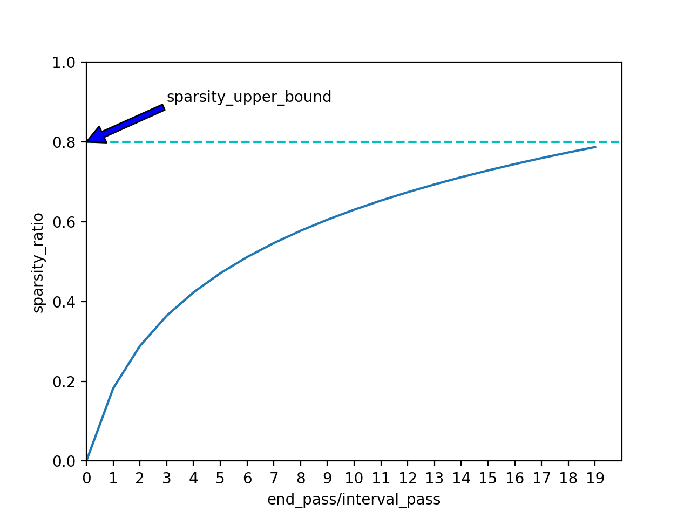

## Pruning

### Principle:

The trained model has a large number of parameters redundancy, and these redundant parameter's value are very small, so we can cut them off.

For every layer chosen to be pruned, we **add a 0-1 value mask** which is of the same size as the layer's parameter and decide which of the parameters participate in the forward process。

Let's assume that the size of parameters in a layer is `M` and current sparsity ratio  is `current_spr`, we first order the parameters according to the absolute value in that layer, then choose the smallest `current_spr * M` numbers out and set the corresponding mask's value to zero.

Paddle uses an **automatic, gradual pruning** approach. We use `interval_pass`, `sparsity_upper_bound` and `end_pass`to control the process of this.
The parameters are pruned every `interval_pass` pass (**a pass represents a epoch**) as the network is fine-tuned to gradually increase the sparsity while allowing the network recover from any pruning-induced loss in accuracy. The network will reach `sparsity_upper_bound` sparsity finally, and the whole process will undergo `end_pass/inter_pass` times pruning.

As shown below, we use a **log function for sparsity changes**. We cut our network more aggressively in the initial stage for there exists a lot of redundant parameters and gradually reduced the number of the parameters being cutted for there are  less redundant parameters in late stage and it's helpful for our network recover from pruning-induced loss in accuracy. 




### Usage:

```python 
from paddle.v2.attr import  Hook
from paddle.v2.attr import  ParamAttr

# The interval_pass value defalut is 3, end_pass value default is 60 
pa = ParamAttr(update_hooks = Hook('dynamic_pruning', sparsity_upper_bound=0.75, interval_pass=1, end_pass=3))

# for conv layer 
paddle.layer.img_conv(input=input,
                      filter_size=3,
                      num_channels=32,
                      num_filters=64,
                      param_attr=pa,
                      act=paddle.activation.Relu())


# for fully connected layer
out = paddle.layer.fc(input=input,
                      size=102,
                      act=paddle.activation.Softmax(),
                      param_attr = pa)
```

### Demo (Mobilenet pruning on flowers102 dataset):
 
Mobilenet is based on depthwise separable convolution that consists a `depthwise convolution` followed by a 1*1 convolution called `pointwise convolution`. About 99% parameters are from `pointwise convolution` and last `fully-connected layer`, so we only prune those two type layers in Mobilenet.

**1**. Download the Mobilenet model pre-trained on flower102
 
|Model|Dataset|Accuracy|Download|
|---|---|---|---|
|Mobilenet|flowers102|97.16%|[Download from BaiduCloud](https://pan.baidu.com/s/1geHkrw3)|

**2**. Run the demo

```
python ./demo/train.py
```

**3**. Result 
  
we evaluated the result in accuracy and modle size.

|--| mobilenet |mobilenet pruning| 
|---| --- | --- |
|accuracy|  0.9716 |0.970 |
|model size| 12M |  4.3M |
|Download|[Download from BaiduCloud](https://pan.baidu.com/s/1geHkrw3)|[Download from BaiduCloud](https://pan.baidu.com/s/1ge8wOp1)|
